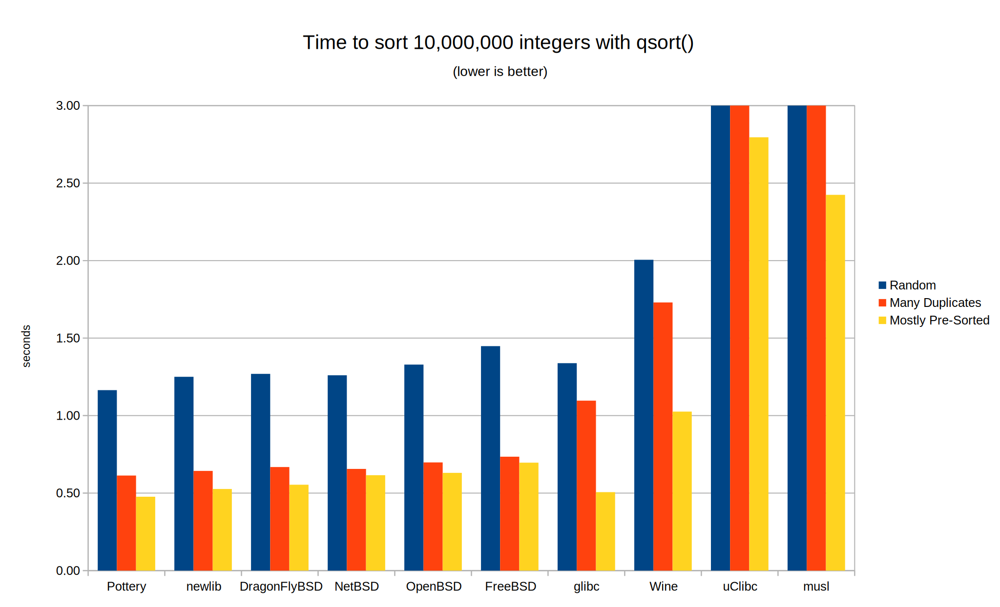

# Pottery `qsort_fast()`

This is a fast (but large) implementation of the standard C `qsort()` function using Pottery. It provides type specializations for common element sizes, giving it better performance in Pottery's benchmarks than all current libc `qsort()` implementations.


### Benchmarks

Thes are the benchmark results for various `qsort()` implementations. 10,000,000 64-bit integers are sorted in three configurations: fully randomized, mostly pre-sorted (0.01% random), or random with many duplicates (each element is randomly chosen from 10,000 distinct numbers.)

All `qsort()` implementations were compiled with the same flags (gcc -O3) to eliminate compilation differences. (Windows `qsort()` was not tested since it is not open source.) Click the graph to see the numbers or run `test/benchmarks.sh` to replicate them:

[](benchmark.md)

This `qsort()` outperforms all current libc `qsort()` implementations. This is despite the fact that it is merely a set of instantiations of Pottery's generic templates. A long-term goal for Pottery is to provide this kind of extreme performance, faster than any ad hoc algorithms and data structures you might write instead. It should take serious investment in a specifically tailored algorithm to beat an instantiation of Pottery.

These are synthetic benchmarks of course; real-world performance will vary. In particular, if the comparison callback is slow, performance will depend primarily on how many times it is called. This was not tested but performance shouldn't differ much from implementations that use the same algorithm (quicksort with three-way partitioning.)


### Implementation Details

Check out the embeddable [`qsort`](../../../util/pottery/qsort/) first to see how `qsort()` can be implemented with Pottery.


#### Size Specialization

The performance gains are made by size specializations for common element sizes. `qsort()` is often called on an array of ints, pointers, or small structs. We can branch on the element size to call a size-specific algorithm like this:

```c
void qsort(void* first, size_t count, size_t element_size,
        int (*compare)(const void* left, const void* right))
{
    if (element_size == sizeof(int) && is_aligned_as(first, int))
        qsort_int(first, count, compare);
    else if (element_size == sizeof(long) && is_aligned_as(first, long))
        qsort_long(first, count, compare);
    else
        qsort_any(first, count, element_size, compare);
}
```

A size-specific algorithm can move values around directly rather than through `memcpy()`, can move whole values into temporaries (which can be in registers), and is not restricted to merely swapping elements.

Several libc `qsort()` implementations already provide a precursor to this optimization. This was described in the classic paper [_Engineering a Sort Function_ by Bentley and McIlroy (1993)](https://cs.fit.edu/~pkc/classes/writing/samples/bentley93engineering.pdf): macros detect whether the element size is an integer and properly aligned, and if so, the pivot is pulled into a temporary and swaps are performed by integer stores and loads. However this is still done from a shared implementation of Quicksort. The algorithm is limited to swaps and a branch is incurred at every swap.

In this `qsort()` a full independent implementation of Pottery's [quick_sort](../../../include/pottery/quick_sort/) is instantiated for each optimized size in addition to the generic implementation. This means the algorithm is not limited to swaps. In the optimized partitioning algorithm, the pivot is pulled out into a temporary leaving a hole in the array. Inversions are done by alternating between sides moving elements into the hole from one partition to another. This results in two thirds as many moves per inversion compared to swap.

A shared [heap_sort](../../../include/pottery/heap_sort/) is used as a depth fallback to guarantee safe worst-case performance so the overall algorithm is still introsort. This is not specialized in order to minimize code size. The fallback is no slower than traditional `qsort()` implementations and it still provides guaranteed O(nlogn) worst-case performance.

A size specialization is instantiated for each of 2, 4, 8, 12, 16, 24 and 32 byte element sizes (with 2, 4 or 8 byte alignment), as well as an arbitrarily large element size.


#### Extension Variations

The instantiation process can be repeated for the `qsort_r()` extension variations rather than sharing an implementation. This eliminates a potential branch at every comparison call.

These are the variations of `qsort()` implemented here. They all have mutually incompatible interfaces, though some are implemented by wrapping others where possible without performance cost. There's a good description of the differences between them on [this StackOverflow post](https://stackoverflow.com/a/39561369).

- `pottery_qsort()` - Standard C `qsort()`
- `pottery_gnu_qsort_r()` - GNU glibc (and uClibc) `qsort_r()`
- `pottery_bsd_qsort_r()` - BSD (and macOS) `qsort_r()`
- `pottery_win_qsort_s()` - Windows `qsort_s()`
- `pottery_c11_qsort_s()` - C11 Annex K `qsort_s()`


#### Code Size

In this example, Pottery's [`quick_sort`](../../../include/pottery/quick_sort/) template is instantiated 24 times for each combination of size and extension variation. This results in about 150 Pottery template instantiations with some 1300 `#include` directives. It compiles to roughly 75kb of machine code with gcc -O3 on amd64.

(Compiling this with gcc -O3 takes over three seconds on my machine! This is a nearly insufferable amount of time to compile a C source file. Still, it demonstrates that compile times are still manageable even with extensive use of Pottery. They are nothing compared to the glacial compile times of some other languages.)

Of course the size can be reduced. If you keep only the pointer-sized specialization the code size is about 27kb, so 9kb for each of `qsort()`, `gnu_qsort_r()` and `bsd_qsort_r()`. Most of these specializations are probably pointless; they are here for demonstration purposes. The size could be reduced furthur by sharing the `qsort()` and `gnu_qsort_r()` implementations on platforms where the function pointer can be safely cast to ignore the `user_context` argument. Many qsort() implementations do this already although it's technically not legal C.


### Using This Code

It probably doesn't make sense to include this in every application that wants to use `qsort()`. It would be faster and smaller to replace every call to `qsort()` in your app with a strongly-typed instantiation of an appropriate Pottery sort template. But maybe this code makes sense for a dynamically linked libc focused on maximum speed.

If you did want to statically link this into your app, it would make sense to pull the entry points into the header file and force-inline them, and even eliminate the alignment checks on platforms that allow unaligned access. Hopefully you're passing the result of `sizeof` as the element size; it should be a compile-time constant. This would in theory optimize to a direct call to a size-specific introsort and the linker could gc all of the ones you don't use. We don't do this here because this is just an example, and it's better suited for a dynamic libc anyway.

This code has not been extensively tested. Use at your own risk.
