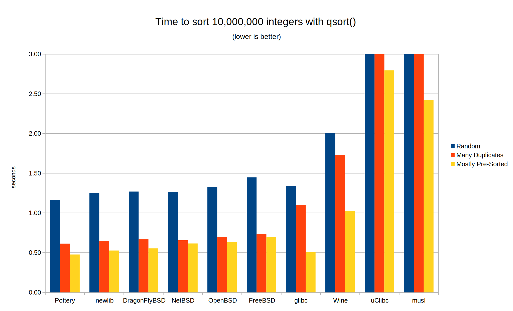

These are my results for `qsort()` algorithms from `test/benchmark.sh` using GCC 10.2.0 on my Ryzen 1700. Sources are compiled with -O3. Ratios are similar under -O2 and with Clang under -Os, -O2 and -O3. Pottery's performance with GCC -Os is somewhat worse; I haven't bothered to investigate why.

|                              | Random (s) | Many Duplicates (s) | Mostly Pre-Sorted (s) | Geometric Mean Ratio |
|------------------------------|------------|---------------------|-----------------------|----------------------|
| Pottery                      | 1.16       | 0.61                | 0.48                  | 1.00                 |
| newlib                       | 1.25       | 0.64                | 0.53                  | 1.08                 |
| DragonFlyBSD (also ReactOS)  | 1.27       | 0.67                | 0.55                  | 1.11                 |
| NetBSD                       | 1.26       | 0.66                | 0.62                  | 1.14                 |
| OpenBSD                      | 1.33       | 0.70                | 0.63                  | 1.20                 |
| FreeBSD (also macOS, Bionic) | 1.45       | 0.73                | 0.70                  | 1.30                 |
| glibc                        | 1.34       | 1.10                | 0.51                  | 1.30                 |
| Wine                         | 2.01       | 1.73                | 1.03                  | 2.19                 |
| uClibc                       | 5.08       | 3.94                | 2.80                  | 5.48                 |
| musl                         | 7.30       | 6.87                | 2.42                  | 7.10                 |

